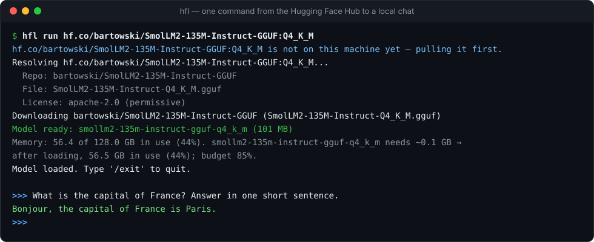
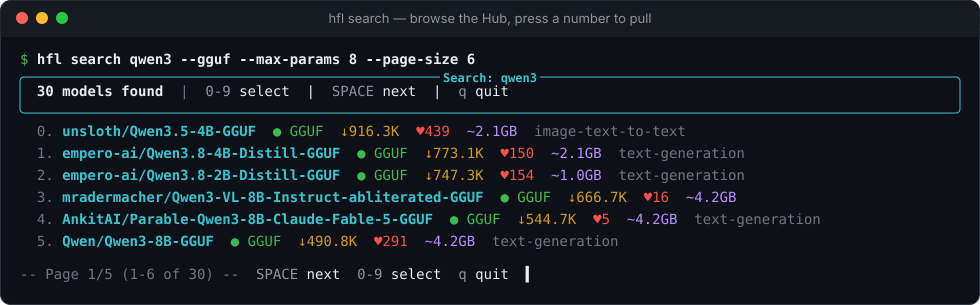

<div align="center">

# HFL

**Descarga, ejecuta y prueba cualquier modelo de Hugging Face en tu propia máquina.**

Un solo comando lleva un modelo del Hub a un chat local o a una API compatible
con OpenAI, Ollama y Anthropic. Sin cuenta. Sin nube propia, por diseño.

[](https://pypi.org/project/hfl/)
[](https://pypi.org/project/hfl/)
[](LICENSE)
[](https://github.com/ggalancs/hfl/pkgs/container/hfl)
[](https://github.com/ggalancs/hfl/actions/workflows/ci.yml)

[Empezar](#empezar) · [Por qué HFL](#por-qué-hfl) · [Instalación](#instalación) · [Uso](#uso) · [API](#conecta-tus-herramientas) · [Documentación](#documentación) · **[English](README.md)**

</div>

<p align="center">
  
</p>

## Empezar

```bash
pip install "hfl[llama,mlx]"        # la parte MLX solo se instala en Apple Silicon

hfl run hf.co/bartowski/Llama-3.2-3B-Instruct-GGUF:Q4_K_M
```

El modelo se descarga la primera vez y después se reutiliza desde el disco. Para servirlo como API:

```bash
hfl serve --model hf.co/bartowski/Llama-3.2-3B-Instruct-GGUF:Q4_K_M
```

Cualquier cliente de OpenAI, Ollama o Anthropic puede hablar ya con `http://localhost:11434`,
y abrir esa dirección en el navegador te da una página de chat servida por el propio HFL
(sin cuenta y sin cargar nada de internet): tus conversaciones, mensaje de sistema y
temperatura por conversación, e imágenes para los modelos que pueden verlas.

## Por qué HFL

- **Todo el Hub, no un único formato.** Los repositorios GGUF funcionan con
  llama.cpp, los builds MLX se ejecutan de forma nativa en Apple Silicon y los
  checkpoints safetensors se convierten y cuantizan solos al descargarlos. Copia
  el nombre de un repositorio del Hub y ejecútalo.
- **Explora el Hub desde tu terminal.** `hfl search` recorre el Hub en vivo
  página a página, con tamaño, descargas y formato de un vistazo; filtra por GGUF
  o por tamaño, pulsa un número y el modelo se descarga, con la licencia
  comprobada antes.
- **Solo tuyo.** Sin cuenta, sin inicio de sesión, sin un servicio en la nube
  detrás. Por su cuenta HFL habla con un solo servidor, el Hub de Hugging Face,
  para descargar pesos; sus endpoints de búsqueda web solo salen a internet
  cuando un cliente los llama, y un test fija cada host al que puede llegar el
  código. Sin red, todo lo que ya descargaste sigue funcionando.
- **Se conecta a lo que ya usas.** Las APIs de OpenAI (chat, completions,
  embeddings, Responses), Ollama y Anthropic Messages en un solo puerto, con
  llamadas a herramientas estructuradas para las familias Qwen, Llama 3, Mistral,
  Gemma 4, gpt-oss, DeepSeek, GLM y Hermes, y salidas con esquema JSON. Respeta las variables `OLLAMA_*` que ya tengas, como
  `OLLAMA_HOST`.
- **Tantos modelos como quepan en tu memoria.** Antes de cada carga HFL estima lo
  que ocupará el modelo (pesos + caché KV) y mantiene la máquina bajo el
  presupuesto de memoria que fijes: los modelos se cargan juntos mientras quepan,
  los ociosos dejan sitio, uno en uso nunca se descarga en mitad de una petición,
  y uno que no cabe se rechaza con las cifras, antes de descargar nada. Tiene en
  cuenta la GPU en NVIDIA.
- **Conoce el Hub.** Encuentra modelos que caben en tu hardware (`hfl recommend`),
  elige la mejor cuantización de la comunidad para tu máquina (`hfl pull-smart`),
  dimensiona los modelos Mixture-of-Experts por sus parámetros totales, comprueba
  licencias antes de descargar y guarda la procedencia de cada descarga.

## Instalación

| Cómo | Comando |
|---|---|
| **pip** (recomendado) | `pip install "hfl[llama,mlx]"` |
| **Docker** | `docker run -p 11434:11434 -v hfl:/var/lib/hfl ghcr.io/ggalancs/hfl` |
| **Instaladores** | `.dmg`, `.msi` y binarios independientes en la [página de releases](https://github.com/ggalancs/hfl/releases) |
| **Desde el código** | `git clone https://github.com/ggalancs/hfl && cd hfl && pip install -e ".[llama,mlx]"` |

<details>
<summary><b>Extras opcionales</b>: GPU, voz, vLLM y más</summary>

| Extra | Añade |
|---|---|
| `llama` | llama.cpp para modelos GGUF (Metal en Apple Silicon sin configurar nada) |
| `mlx` | Backend MLX nativo en Apple Silicon |
| `transformers` | Backend Transformers para inferencia en GPU con bitsandbytes |
| `vllm` | Backend vLLM |
| `convert` | Herramientas para convertir safetensors a GGUF |
| `tts` / `coqui` | Texto a voz (Bark, SpeechT5 / Coqui XTTS, VITS) |
| `stt` | Voz a texto (Whisper) |
| `mcp` | Cliente y servidor de Model Context Protocol |
| `all` | Todo lo anterior |

Convertir safetensors a GGUF compila las herramientas de llama.cpp la primera
vez, lo que necesita **git**, **cmake** y un **compilador de C++**
(`xcode-select --install` en macOS, `sudo apt install build-essential cmake` en
Debian/Ubuntu). Los modelos GGUF ya cuantizados y los MLX no necesitan nada de esto.

</details>

## Uso

### Buscar y elegir desde la terminal

<p align="center">
  
</p>

```bash
hfl search qwen3                          # todo lo que coincide, los más descargados primero
hfl search qwen3 --gguf --max-params 8    # solo GGUF de 8B o menos, buscando en todo el Hub
hfl search llama --sort likes             # o: downloads (por defecto), created
```

Cada página muestra hasta diez modelos con su tamaño, descargas, likes, formato y
tarea. Pulsa **0–9** para descargar uno (confirmas y se comprueba su licencia
antes), **ESPACIO** para la página siguiente, **p** para la anterior y **q** para
salir. Los tamaños son parámetros totales, así que los modelos Mixture-of-Experts
no aparecen más pequeños de lo que son.

### Chat

```bash
hfl run hf.co/bartowski/Llama-3.2-3B-Instruct-GGUF:Q4_K_M   # desde el Hub, se descarga la primera vez
hfl run qwen3-coder                                          # un nombre corto, se busca en el Hub
hfl run hf.co/mlx-community/Qwen2.5-0.5B-Instruct-4bit       # un build MLX en Apple Silicon
hfl run llama70b --system "You are a Python expert"          # un nombre local o un alias
hfl run llama70b --session work                              # retoma y guarda una conversación
```

El prefijo `hf.co/` es opcional. `:Q4_K_M` elige una cuantización y `@<ref>` fija
una rama, etiqueta o commit.

Un nombre corto (`qwen3-coder`, `llama3.2`, `qwen3:8b`, `gemma3:4b-q8_0`) que no
es un modelo local se busca entre los builds GGUF del Hub: primero los instruct y
los cuantizadores habituales, fuera los derivados (abliterated, merges...), y una
cuantización que quepa en tu máquina (Q4_K_M salvo que no quepa). Eliges de la
lista antes de descargar nada (`--yes` toma el primero) y el nombre se guarda como
alias, así que el siguiente `hfl run qwen3-coder` es local. Los clientes de Ollama
obtienen lo mismo con `/api/pull {"model": "llama3.2"}`.

`--session <nombre>` guarda la conversación: el siguiente `hfl run <modelo>
--session <nombre>` la retoma donde se quedó. Las sesiones son ficheros JSON en
`~/.hfl/sessions/`:

```bash
hfl sessions list          # nombre, modelo, mensajes, última actualización
hfl sessions show work     # muestra los mensajes de una sesión
hfl sessions rm work       # la borra
```

### Descargar, buscar y gestionar

```bash
hfl pull meta-llama/Llama-3.3-70B-Instruct                 # Q4_K_M por defecto
hfl pull meta-llama/Llama-3.3-70B-Instruct --quantize Q5_K_M --alias llama70b
hfl pull meta-llama/Llama-3.3-70B-Instruct@a1b2c3d          # reproducible: revisión fijada

hfl list                                # lo que hay en esta máquina
hfl inspect llama70b                    # detalles y licencia
hfl rm llama70b

hfl import ~/.lmstudio/models/lmstudio-community/Qwen3-8B-GGUF   # un GGUF que ya tienes
```

`hfl import` registra un GGUF donde está —sin copiarlo y sin servidor— para
modelos descargados con LM Studio, llama.cpp o a mano; se ocupa de los modelos
divididos y del proyector de un modelo de visión que esté a su lado. `hfl rm`
nunca borra un fichero fuera de la carpeta de HFL.

### Encontrar el modelo adecuado

```bash
hfl recommend                           # los mejores modelos que caben en la RAM/VRAM de ESTA máquina
hfl discover --family qwen              # filtra el Hub en vivo; marca lo que ya tienes
hfl pull-smart Qwen/Qwen3-30B-A3B       # la mejor variante de la comunidad para tu hardware
hfl verify <model>                      # tokenizador, plantilla de chat, generación de prueba, herramientas
hfl bench <model>                       # tiempo hasta el primer token, tokens/s, p50/p95
```

Todas las opciones en [docs/hub-native-features.md](docs/hub-native-features.md).

### Varios modelos a la vez

HFL mantiene cargado cada modelo que quepa bajo `HFL_MEMORY_BUDGET`, el porcentaje
de la RAM total que la máquina puede tener en uso tras una carga, contando los
demás programas (por defecto `85%`). Cada carga muestra las cifras antes de
producirse:

```text
Memory: 65.3 of 128.0 GB in use (51%). qwen3-14b needs ~9.0 GB → after loading, 74.3 GB in use (58%); budget 85%.
```

- cabe → se carga junto a los modelos ya residentes;
- no cabe → se descargan los ociosos, empezando por el menos usado recientemente;
- el hueco lo ocupan modelos respondiendo peticiones → la carga los espera;
- no cabe ni solo → se rechaza con las cifras (HTTP 507), sin descargar nada.

Con una GPU NVIDIA el modelo también debe caber en la tarjeta (leída con
`nvidia-smi`). Los modelos ociosos se descargan tras `keep_alive` (por defecto `5m`,
renovado con cada uso). `hfl ps` y `GET /api/ps` muestran qué está cargado y cuánto
margen queda.

<details>
<summary><b>Llamadas a herramientas</b>: los agentes funcionan sin configurar nada</summary>

Envía `tools` en `/api/chat`, `/v1/chat/completions` o `/v1/messages`: HFL las
pasa por la plantilla de chat del propio modelo (Qwen y Hermes `<tool_call>`,
Llama 3 `<|python_tag|>`, Mistral `[TOOL_CALLS]`, los canales Harmony de
gpt-oss, las marcas propias de DeepSeek y GLM), convierte la respuesta en
`message.tool_calls` con los argumentos como objeto y acepta resultados
`role: "tool"` en el siguiente turno. Cuando la plantilla de un modelo no tiene
sitio para herramientas (Hermes-3, DeepSeek-R1), HFL las escribe en el mensaje
de sistema con la convención de Hermes.

```bash
curl http://localhost:11434/api/chat -d '{
  "model": "qwen3-32b-q4_k_m",
  "stream": false,
  "messages": [{"role": "user", "content": "Save Hello at topics/hello.md"}],
  "tools": [{"type": "function", "function": {
    "name": "write_wiki", "description": "Create or overwrite a wiki article",
    "parameters": {"type": "object",
      "properties": {"path": {"type": "string"}, "content": {"type": "string"}},
      "required": ["path", "content"]}}}]
}'
```

```json
{"message": {"role": "assistant", "content": "",
  "tool_calls": [{"function": {"name": "write_wiki",
    "arguments": {"path": "topics/hello.md", "content": "Hello"}}}]},
 "done": true}
```

Con streaming, `tool_calls` llega en el fragmento final `done: true`. La
especificación ejecutable está en `tests/test_tool_calling_acceptance.py`.

</details>

<details>
<summary><b>Texto a voz</b>: Bark, SpeechT5, Coqui XTTS</summary>

```bash
pip install "hfl[tts,audio]"
hfl pull suno/bark-small --alias bark
hfl tts bark "Hello, this is a test." -o hello.wav     # escribe un fichero (wav, mp3, ogg)
hfl speak bark "Hola mundo" --lang es --speed 0.9      # lo reproduce
```

Opciones: `--lang`, `--voice`, `--speed` (0,25–4,0) y, en `tts`, también
`--output`, `--rate` y `--format`. Las mismas voces se sirven por HTTP:

```bash
# OpenAI-compatible
curl http://localhost:11434/v1/audio/speech -H "Content-Type: application/json" \
  -d '{"model": "bark", "input": "Hello world", "voice": "alloy"}' --output speech.wav

# Nativo: idioma, velocidad, frecuencia de muestreo y formato (wav, mp3, ogg)
curl http://localhost:11434/api/tts -H "Content-Type: application/json" \
  -d '{"model": "bark", "text": "Hola mundo", "language": "es"}' --output speech.wav
```

</details>

<details>
<summary><b>Más herramientas</b>: LoRA, instantáneas de KV, decodificación especulativa, MCP, subida al Hub</summary>

- `hfl lora apply|remove|list`: cambia adaptadores LoRA en caliente sin recargar el modelo base.
- `hfl snapshot save|load|list|delete`: guarda la caché KV en disco para arrancar en caliente.
- `hfl draft-recommend`: elige un modelo pequeño hermano del Hub para decodificación especulativa.
- `hfl mcp serve` / `hfl mcp connect`: funciona como servidor Model Context Protocol o usa herramientas MCP.
- `hfl compliance-dashboard`: riesgo de licencia de tus modelos locales.
- `POST /api/push`: sube al Hub un modelo registrado.
- `WS /ws/chat`: chat bidireccional con cancelación por mensaje.

</details>

## Conecta tus herramientas

**Agentes de programación.** Un comando abre Claude Code o Codex sobre un modelo local:

```bash
hfl launch claude -m hf.co/unsloth/Qwen3-Coder-30B-A3B-Instruct-GGUF:Q4_K_M
hfl launch codex  -m qwen-coder                 # también vale un nombre local o un alias
hfl launch claude -m qwen-coder --print         # solo muestra la configuración para tu shell
```

HFL descarga el modelo si hace falta, arranca un servidor si no hay ninguno
(y lo para cuando el agente termina), carga el modelo y le pasa al agente su
ventana de contexto real. No se toca la configuración propia del agente.
Lo que va tras `--` se le pasa al agente: `hfl launch claude -m qwen-coder -- -p "arregla los tests"`.

El servidor escucha en `http://localhost:11434` y habla tres APIs. Por defecto
atiende una petición a la vez por modelo GGUF; `hfl serve --parallel 4` (con
llama.cpp instalado) atiende varias a la vez, lo que necesitan los agentes de
programación y varios usuarios.

**OpenAI** — `/v1/chat/completions`, `/v1/completions`, `/v1/embeddings`, `/v1/responses`,
`/v1/audio/speech`, `/v1/audio/transcriptions`, `/v1/images/generations`

```python
from openai import OpenAI

client = OpenAI(base_url="http://localhost:11434/v1", api_key="not-needed")
reply = client.chat.completions.create(
    model="hf.co/bartowski/Llama-3.2-3B-Instruct-GGUF:Q4_K_M",
    messages=[{"role": "user", "content": "Explain quantum computing in one paragraph"}],
)
print(reply.choices[0].message.content)
```

**Ollama** — `/api/chat`, `/api/generate`, `/api/embed`, `/api/tags`, `/api/ps`, `/api/pull`,
`/api/delete` (solo desde la propia máquina del servidor) y más

```bash
curl http://localhost:11434/api/chat -d '{"model": "llama70b",
  "messages": [{"role": "user", "content": "Hello!"}]}'
```

**Anthropic** — `/v1/messages`

```bash
curl http://localhost:11434/v1/messages -H "Content-Type: application/json" \
  -d '{"model": "llama70b", "max_tokens": 256,
       "messages": [{"role": "user", "content": "Hello!"}]}'
```

El razonamiento de un modelo que piensa nunca llega como su respuesta. Cada API
lo recibe donde ella pone el razonamiento: `message.thinking` en `/api/chat`
(con `think`), `reasoning_content` en `/v1/chat/completions`, un item
`reasoning` en `/v1/responses`, un bloque `thinking` en `/v1/messages` (con
`thinking` activado). `think: false`, `reasoning_effort: "none"` y
`thinking: {"type": "disabled"}` le dicen al modelo que no piense.

Los modelos se pueden nombrar por su nombre local, un alias o la referencia del
Hub de la que se descargaron (`hf.co/org/repo:CUANT`). El servidor nunca descarga
por su cuenta: lo hacen `hfl pull` o `hfl serve --model <referencia>`.

## Referencia

<details>
<summary><b>Configuración</b></summary>

| Variable | Por defecto | Qué hace |
|---|---|---|
| `HFL_HOME` | `~/.hfl` | Dónde viven los modelos, el registro y los logs |
| `HF_TOKEN` | — | Token de Hugging Face para modelos restringidos (o `hfl login`) |
| `HFL_MEMORY_BUDGET` | `85` | % de la RAM total que puede estar en uso tras una carga |
| `HFL_KEEP_ALIVE` | `5m` | Cuánto sigue cargado un modelo ocioso (`-1` = siempre) |
| `HFL_MAX_LOADED_MODELS` | `0` | Techo opcional de modelos cargados |
| `HFL_LANG` | `en` | Idioma de la CLI: `en` o `es` |

Los ajustes que Ollama también tiene (`OLLAMA_HOST`, `OLLAMA_KEEP_ALIVE`,
`OLLAMA_NUM_PARALLEL`, `OLLAMA_MAX_LOADED_MODELS`, …) se leen con cualquiera de los
dos nombres. La lista completa está en [docs/env-vars.md](docs/env-vars.md).

`hfl config` muestra los directorios, la dirección del servidor, los límites de
peticiones, los valores por defecto de inferencia y los tiempos máximos en uso,
ya aplicadas las variables de entorno.

Protege la API con una clave: `hfl serve --api-key <secreto>` y envía
`Authorization: Bearer <secreto>` o `X-API-Key: <secreto>`.

</details>

<details>
<summary><b>Concurrencia y contrapresión</b></summary>

llama.cpp y Transformers usan una única instancia del modelo que no admite dos
peticiones a la vez, así que HFL ejecuta la inferencia de una en una tras una cola
acotada, compartida por las tres APIs:

| Ajuste | Variable | Por defecto |
|---|---|---|
| Peticiones ejecutándose a la vez | `HFL_QUEUE_MAX_INFLIGHT` | `1` |
| Peticiones que pueden esperar | `HFL_QUEUE_MAX_SIZE` | `16` |
| Segundos que puede esperar una petición | `HFL_QUEUE_ACQUIRE_TIMEOUT` | `60` |

Una cola llena responde **429** con `Retry-After`; una petición que esperó demasiado
responde **503**. Cada respuesta lleva `X-Queue-Depth` y cabeceras relacionadas, y
`GET /healthz` informa del estado en vivo.

</details>

<details>
<summary><b>Niveles de cuantización</b></summary>

`Q4_K_M` es el nivel por defecto y el equilibrio habitual entre tamaño y calidad.
`Q5_K_M`, `Q6_K` y `Q8_0` se acercan más al modelo original y ocupan más memoria;
`Q3_K_M` y `Q2_K` ocupan menos, con una pérdida de calidad apreciable; `F16` no está
cuantizado. HFL te dice antes de cargar si un modelo cabe, y `hfl recommend`
sugiere los que caben.

</details>

<details>
<summary><b>Cómo funciona</b></summary>

```text
hfl pull / run ──▶ Hugging Face Hub ──▶ ~/.hfl/models ──▶ GGUF? ── yes ──▶ llama.cpp
                   (search, download,                  MLX build (Apple Silicon) ──▶ MLX
                    license check)                     safetensors ── convert + quantize ──▶ GGUF

hfl serve ──▶ OpenAI · Ollama · Anthropic APIs ──▶ memory-budgeted model set ──▶ one inference at a time
```

La [guía de arquitectura](https://htmlpreview.github.io/?https://github.com/ggalancs/hfl/blob/main/docs/hfl-arquitectura-completa.html)
cubre los módulos, la selección del motor, el proceso de conversión y cada endpoint
([in English](https://htmlpreview.github.io/?https://github.com/ggalancs/hfl/blob/main/docs/hfl-architecture-complete.html)).

</details>

## Documentación

- [Funciones propias del Hub](docs/hub-native-features.md): discover, recommend, pull-smart, verify, bench y más
- [Variables de entorno](docs/env-vars.md): cada ajuste y su valor por defecto
- [Apple Silicon y clientes en Docker](docs/apple-silicon-and-docker-clients.md)
- [Benchmarks](docs/benchmarks.md): HFL, Ollama y llama-server con el mismo GGUF, y el script para repetirlo
- [Compatibilidad de modelos](docs/compatibility.md): chat, herramientas, razonamiento y visión comprobados de verdad en 13 familias y los dos backends GGUF
- [Guía de arquitectura](https://htmlpreview.github.io/?https://github.com/ggalancs/hfl/blob/main/docs/hfl-arquitectura-completa.html)
- [Registro de cambios](CHANGELOG.md)

**Estado:** beta, con más de 4.000 tests y ~90 % de cobertura. Hay builds e
instaladores para Windows, pero Windows está menos probado que macOS y Linux.

## Contribuir

Issues y pull requests son bienvenidos: consulta [CONTRIBUTING.md](CONTRIBUTING.md).

```bash
git clone https://github.com/ggalancs/hfl && cd hfl
pip install -e ".[dev]"
bash scripts/ci-local.sh        # lint, tipos y la suite completa de tests, como en la CI
```

Si HFL te ahorra una tarde de descargar, convertir y cuantizar, una ⭐ ayuda a que otros lo encuentren.

## Avisos legales

**Licencias de los modelos.** Cada modelo conserva su propia licencia (Llama,
Gemma, OpenRAIL, CC-BY-NC, …) y eres responsable de cumplirla. HFL muestra la
licencia de un modelo antes de descargarlo, la guarda con el modelo y registra la
procedencia de la descarga: consulta `hfl inspect <modelo>`. Restricciones
habituales: solo uso no comercial (CC-BY-NC, MRL), atribución (Llama, Gemma) y
restricciones de uso (OpenRAIL).

**Control de exportaciones.** HFL solo descarga modelos de pesos abiertos
disponibles públicamente en el Hub de Hugging Face y no facilita el acceso a pesos
cerrados ni sujetos a control de exportación. Cada usuario es responsable de
cumplir la normativa de exportación de su jurisdicción.

**Descargo de responsabilidad.** Los modelos de IA pueden generar contenido
inexacto, sesgado o inapropiado. Cada usuario es el único responsable de evaluar y
usar las respuestas de los modelos. Consulta [DISCLAIMER.md](DISCLAIMER.md).

**Marcas.** "OpenAI" es una marca de OpenAI, Inc. "Ollama" es una marca de
Ollama, Inc. "Anthropic" es una marca de Anthropic, PBC. "Hugging Face" y su logo
son marcas de Hugging Face, Inc. Se usan solo con fines de identificación. **HFL
es un proyecto independiente, sin afiliación, respaldo ni conexión oficial con
ninguna de estas empresas.** Las referencias a sus servicios describen solo
interoperabilidad técnica.

## Licencia

HFL se distribuye bajo la **Licencia Apache 2.0**: puedes usarlo, modificarlo,
distribuirlo y venderlo, también comercialmente, siempre que mantengas los avisos
de copyright y de licencia. Consulta [LICENSE](LICENSE) y [NOTICE](NOTICE).

HFL incluye salvaguardas de uso responsable: comprobación de licencias, avisos
sobre IA, registro de procedencia, protección de la privacidad y respeto por los
modelos restringidos. Apache-2.0 no te obliga a mantenerlas; como norma del
proyecto pedimos que las redistribuciones las dejen activas. Consulta
[DISCLAIMER.md](DISCLAIMER.md), [PRIVACY.md](PRIVACY.md) y
[NOTICE-EU-AI-ACT.md](NOTICE-EU-AI-ACT.md).

La licencia de HFL cubre a HFL, no a los modelos que descargas.
